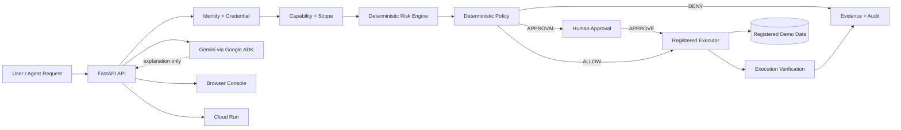

# ActionPermit Architecture

## Trust boundary

## Security invariant

Gemini can explain a decision but cannot create authorization. Only deterministic server-side policy can produce `ALLOW` or `REQUIRE_APPROVAL`. The executor accepts only registered capabilities and successful execution must be verified.

## Lifecycle

`INTENT_RECEIVED → POLICY_EVALUATED → DENIED | APPROVAL_REQUIRED | EXECUTING → COMPLETED | FAILED`

## Cloud boundary

Cloud Run hosts the API and static frontend. Credentials are server-side only. GitHub Actions uses OIDC/Workload Identity Federation for deployment rather than long-lived service-account keys.

## Evidence

Every decision receives an evidence ID. Approval records bind to a request fingerprint and evidence ID. Audit events record policy evaluation, approval, execution start/completion/failure and rejection paths.
